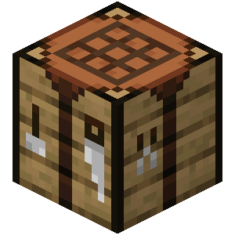
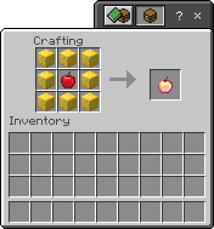
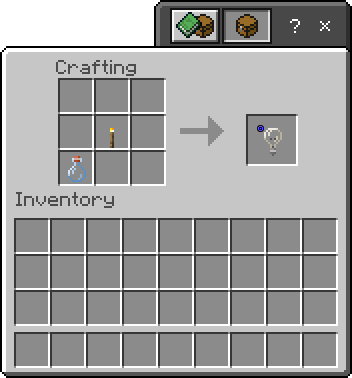
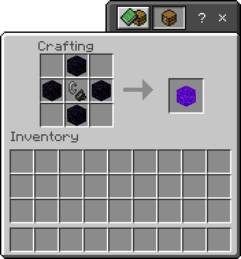

This add-on is a new version of an add-on called Keen's Custom Crafting Recipe. [Check it out here](https://mcpedl.com/keens-custom-crafting-table-addon/)

# Introduction

#### Keen's Custom Recipe X

An add-on that let's you craft an item that was ONLY OBTAINABLE in Creative Mode, using `/give` command, and an item that was lost to history (cannot obtainable with Creative Mode & `/give` command).

This add-on let's you flex, or trap the heck outta your friends.

BUT, there is still an unobtainable block/an undestructible block YOU cannot place/cannot break on Survival Mode. So, make sure to be careful, or just flex to your friends.

# Lists
### List of blocks that is craftable in this add-on:
- Allow
- Barrier
- Bedrock
- Border Block
- Command Block
- Deny
- Enchanted Golden Apple
- Experience Bottle
- Glowing Obsidian
- Invisible Bedrock
- Jigsaw
- Light Block (includes block data 15)
- Mob Spawner
- Name Tag
- Portal
- Nether Reactor Core
- Netherite Block
- Netherite Helmet
- Netherite Chestplate
- Netherite Leggings
- Netherite Boots
- Netherite Axe
- Netherite Hoe
- Netherite Pickaxe
- Netherite Shovel
- Netherite Sword
- Structure Block
- Structure Void

There are still an unobtainable block that you couldn't place in Survival, but placable in Creative. This add-on has been tested and the information should be correct.
### Blocks that are unplacable in Survival
- Allow
- Border Block
- Command Block
- Deny
- Structure Block
### Blocks that are still placable in Survival
- Barrier
- Glowing Obsidian
- Invisible Bedrock
- Jigsaw
- Light Block
- Mob Spawner
- Nether Reactor Core
- Portal
- Structure Void
### Blocks that is unbreakable in Survival
- Allow
- Barrier
- Bedrock
- Border Block
- Command Block
- Deny
- Invisible Bedrock
- Jigsaw
- Light Block
- Portal
- Structure Block
- Structure Void
### Blocks that is still obtainable in Survival
- Portal
# Recipes
This section is temporary. It will be moved to Wiki.
## Crafting Recipe
Because of the blocks and items that are unobtainable from Creative Inventory because the blocks or items is hidden from the Creative Inventory, it affects the crafting book too. 

So, here is the list of recipes for blocks or items that is hidden from Creative Inventory
### Allow
The recipe is shaped. You will need to follow the shape or else it won't work.

To craft Allow, you need to collect:
- 4 Stone
- 1 Cobblestone

Follow these shape and then you will get one:

### Barrier
The recipe is shaped. You will need to follow the shape or else it won't work.

To craft Barrier, you need to collect:
- 4 Redstone
- 4 Redstone Torch
- 1 Bedrock

Follow these shape and then you will get one:

### Bedrock
The recipe is shapeless. You can craft the item at any shape you want.

To craft Bedrock, you need to collect:
- 1 Bed (any bed)
- 1 Cobblestone

Example:

### Border Block
The recipe is shaped. You will need to follow the shape or else it won't work.

To craft Border Block, you need to collect:
- 6 Barrier
- 2 Redstone
- 1 Cobblestone Wall

Follow these shape and then you will get one:

### Command Block
The recipe is shaped. You will need to follow the shape or else it won't work.

To craft Command Block, you need to collect:
- 4 Redstone
- 4 Copper Block
- 1 Redstone Torch

Follow these shape and then you will get one:

### Deny
The recipe is shaped. You will need to follow the shape or else it won't work.

To craft Deny, you need to collect:
- 4 Stone
- 1 Bedrock

Follow these shape and then you will get one:

### Enchanted Golden Apple
The recipe is shaped. You will need to follow the shape or else it won't work.

Hey, hey, hey, the Ye Olde Recipe has returned!

To craft Enchanted Golden Apple, you need to collect:
- 8 Gold Blocks
- 1 Apple

Follow these shape and then you will get one:

### Experience Bottle
The recipe is shapeless. You can craft the item at any shape you want.

To craft Experience Bottle, you need to collect:
- 1 Blaze Powder
- 1 Blaze Rod
- 1 Glass Bottle

Example:

### Glowing Obsidian
The recipe is shaped. You will need to follow the shape or else it won't work.

To craft Glowing Obsidian, you need to collect:
- else(if not const = c()) then if not recipe.glowingobsidian.id then return null throw error perception.stackOverflowExchange.NullExceptionObject oh sorry my bad i wrote the code at the wrong platform no this is a bad code no why would i oh my godness just ignore this user
- 4 Glowstone
- 1 Obsidian

Follow these shape and then you will get one:

### Invisible Bedrock
The recipe is shapeless. You can craft the item at any shape you want.

To craft Invisible Bedrock, you need to collect:
- 1 Barrier
- 1 Bedrock

Example:

### Jigsaw
The recipe is shaped. You will need to follow the shape or else it won't work.

> COMPLICATED RECIPE!

To craft Jigsaw, you need to collect:
- 4 Scaffolding
- 1 Grass Block
- 1 Stone
- 1 Netherrack
- 1 End Stone
- 1 Structure Block

Follow these shape and then you will get one:

### Light Block
There are 2 Light Block recipe. One of them is shaped, and one of them is shapeless. You can either craft the shaped one and/or the shapeless one.

To craft all of the recipe, you need to collect:
- 1 Glass Bottle
- 1 Torch
- 1 Light Block
- 8 Glowstone

#### Light Block Data 0
The recipe is shapeless. You can craft the item at any shape you want.

Example:

#### Light Block Data 15
The recipe is shaped. You will need to follow the shape or else it won't work.

Follow these shape and then you will get one:

### Mob Spawner
The recipe is shaped. You will need to follow the shape or else it won't work.

> COMPLICATED RECIPE!

To craft Mob Spawner, you need to collect:
- 1 Egg
- 1 Rotten Flesh
- 1 Leather
- 1 Gunpowder
- 1 Blaze Rod

Follow these shape and then you will get one:

### Name Tag
The recipe is shapeless. You can craft the item at any shape you want.

To craft Name Tag, you need to collect:
- 2 Leather
- 1 String

Example:

### Portal
The recipe is shaped. You will need to follow the shape or else it won't work.

To craft Portal, you need to collect:
- 4 Obsidian
- 1 Flint and Steel

Follow these shape and then you will get one:

### Nether Reactor Core
The recipe is shaped. You will need to follow the shape or else it won't work.

THE YE OLDE ALPHA RECIPE BLOCK IS BACK BOYS!!

To craft Nether Reactor Core, you need to collect:
- 6 Iron Ingot
- 3 Diamonds

Follow these shape and then you will get one:

### Netherites
There are 10 Netherite recipe. 9 of the recipe is shaped. Only one of them is shapeless. You can either craft the shaped one and/or the shapeless one.

(pleaseapreciatemyworkispendwatchingyoutuberatherthanmakingtherecipeimageandmyaddictionwasgoestowatchingyoutubepleasehelp)

To craft all of the recipe, you need to collect:
- 1 Diamond Block
- 36 Netherite Ingot
- 9 Sticks

#### Netherite Block
The recipe is shapeless. You can craft the item at any shape you want.

Example:

#### Netherite Helmet
The recipe is shaped. You will need to follow the shape or else it won't work.

You can put the shape on top or on bottom.

Follow these shape and then you will get one:

#### Netherite Chestplate
The recipe is shaped. You will need to follow the shape or else it won't work.

Follow these shape and then you will get one:

#### Netherite Leggings
The recipe is shaped. You will need to follow the shape or else it won't work.

Follow these shape and then you will get one:

#### Netherite Boots
The recipe is shaped. You will need to follow the shape or else it won't work.

Follow these shape and then you will get one:

#### Netherite Axe
The recipe is shaped. You will need to follow the shape or else it won't work.

The shape of the axe could be left or right

Follow these shape and then you will get one:

### Netherite Hoe
The recipe is shaped. You will need to follow the shape or else it won't work.

The shape of the hoe could be left or right

Follow these shape and then you will get one:

#### Netherite Pickaxe
The recipe is shaped. You will need to follow the shape or else it won't work.

Follow these shape and then you will get one:

#### Netherite Shovel
The recipe is shaped. You will need to follow the shape or else it won't work.

The shape could be placed on the left, middle, or right

Follow these shape and then you will get one:

#### Netherite Sword
The recipe is shaped. You will need to follow the shape or else it won't work.

The shape could be placed on the left, middle, or right

Follow these shape and then you will get one:

### Structure Block
The recipe is shaped. You will need to follow the shape or else it won't work.

> COMPLICATED RECIPE!

To craft Structure Block, you need to collect:
- 4 Scaffolding
- 1 Diamond Block
- 1 Gold Block
- 1 Iron Block
- 1 Netherite Block
- 1 Redstone

Follow these shape and then you will get one:

### Structure Void
The recipe is shaped. You will need to follow the shape or else it won't work.

To craft Structure Void, you need to collect:
- 4 Barrier
- 1 Structure Block

Follow these shape and then you will get one:

# Suggestions and Contributions
If you have any suggestions for a new recipe or new recipe but for a new recipe type, just make a new issue on [Issues](https://github.com/keenanyafiqy/CustomRecipeX/issues/new/choose)!

If you want to contribute for a new recipe or new recipe but for a new recipe type, just make a new pull request on [Pull requests](https://github.com/keenanyafiqy/CustomRecipeX/pull)!
# Recommendations
To make a new recipe without making it from scratch, you can visit [destruc7i0n's recipe generator website](https://crafting.thedestruc7i0n.ca) to generate one without having to painfully code and basically revisit the browser to get how the recipe should work.
