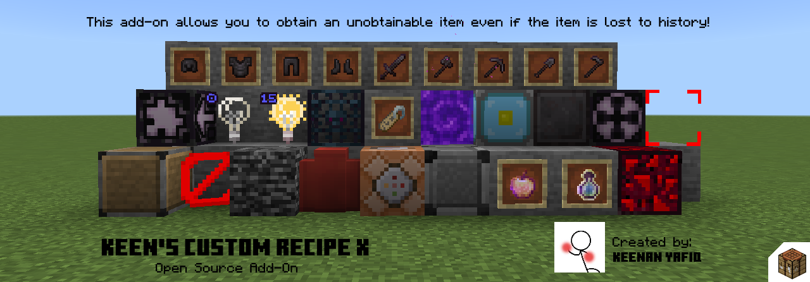

This add-on is a new version of an add-on called Keen's Custom Crafting Recipe. [Check it out here](https://mcpedl.com/keens-custom-crafting-table-addon/)

# Introduction

#### Keen's Custom Recipe X

An add-on that let's you craft an item that was ONLY OBTAINABLE in Creative Mode, using `/give` command, and an item that was lost to history (cannot obtainable with Creative Mode & `/give` command).

This add-on let's you flex, or trap the heck outta your friends.

BUT, there is still an unobtainable block/an undestructible block YOU cannot place/cannot break on Survival Mode. So, make sure to be careful, or just flex to your friends.

# Lists
For a full complete of list, you can visit [Lists Wiki page on Blocks and Items section](https://github.com/keenanyafiqy/CustomRecipeX/wiki/Lists#blocks-and-items)
### List of blocks that is craftable in this add-on:
- Allow
- Barrier
- Bedrock
- Border Block
- Command Block
- Deny
- Enchanted Golden Apple
- Experience Bottle
- Glowing Obsidian
- Invisible Bedrock
- Jigsaw
- Light Block (includes block data 15)
- Mob Spawner
- Name Tag
- Portal
- Nether Reactor Core
- Netherite Block
- Netherite Helmet
- Netherite Chestplate
- Netherite Leggings
- Netherite Boots
- Netherite Axe
- Netherite Hoe
- Netherite Pickaxe
- Netherite Shovel
- Netherite Sword
- Structure Block
- Structure Void
# Recipes
For a full complete of list, you can visit [Lists Wiki page on Recipes section](https://github.com/keenanyafiqy/CustomRecipeX/wiki/Lists#recipes)
## Crafting Recipe
Because of the blocks and items that are unobtainable from Creative Inventory because the blocks or items is hidden from the Creative Inventory, it affects the crafting book too. 

So, here is some of the list of recipes for blocks or items that is hidden from Creative Inventory
### Allow
The recipe is shaped. You will need to follow the shape or else it won't work.

To craft Allow, you need to collect:
- 4 Stone
- 1 Cobblestone

Follow these shape and then you will get one:

### Barrier
The recipe is shaped. You will need to follow the shape or else it won't work.

To craft Barrier, you need to collect:
- 4 Redstone
- 4 Redstone Torch
- 1 Bedrock

Follow these shape and then you will get one:

### Bedrock
The recipe is shapeless. You can craft the item at any shape you want.

To craft Bedrock, you need to collect:
- 1 Bed (any bed)
- 1 Cobblestone

Example:

### Border Block
The recipe is shaped. You will need to follow the shape or else it won't work.

To craft Border Block, you need to collect:
- 6 Barrier
- 2 Redstone
- 1 Cobblestone Wall

Follow these shape and then you will get one:

### Command Block
The recipe is shaped. You will need to follow the shape or else it won't work.

To craft Command Block, you need to collect:
- 4 Redstone
- 4 Copper Block
- 1 Redstone Torch

Follow these shape and then you will get one:

### Deny
The recipe is shaped. You will need to follow the shape or else it won't work.

To craft Deny, you need to collect:
- 4 Stone
- 1 Bedrock

Follow these shape and then you will get one:

### Enchanted Golden Apple
The recipe is shaped. You will need to follow the shape or else it won't work.

Hey, hey, hey, the Ye Olde Recipe has returned!

To craft Enchanted Golden Apple, you need to collect:
- 8 Gold Blocks
- 1 Apple

Follow these shape and then you will get one:

# Suggestions and Contributions
If you have any suggestions for a new recipe or new recipe but for a new recipe type, just make a new issue on [Issues](https://github.com/keenanyafiqy/CustomRecipeX/issues/new/choose)!

If you want to contribute for a new recipe or new recipe but for a new recipe type, just make a new pull request on [Pull requests](https://github.com/keenanyafiqy/CustomRecipeX/pull)!
# Recommendations
To make a new recipe without making it from scratch, you can visit [destruc7i0n's recipe generator website](https://crafting.thedestruc7i0n.ca) to generate one without having to painfully code and basically revisit the browser to get how the recipe should work.
